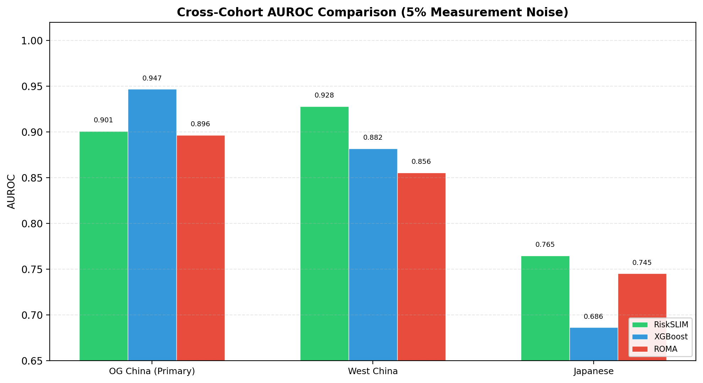
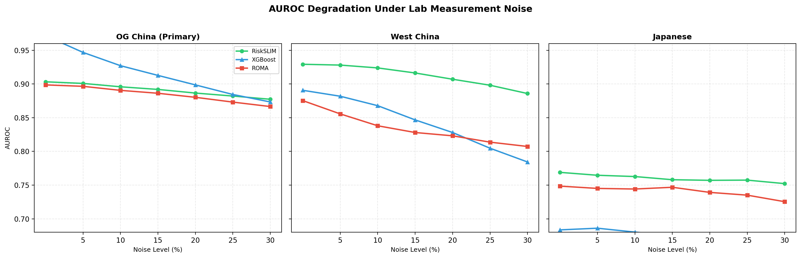

# Ovarian Cancer ML — Results Summary

## 1. Cross-Cohort AUROC (5% Measurement Noise)

| Model | OG China (Primary) | West China | Japanese |
| :---- | :---: | :---: | :---: |
| RiskSLIM | 0.9008 | 0.9280 | 0.7646 |
| XGBoost | 0.9468 | 0.8818 | 0.6861 |
| ROMA | 0.8965 | 0.8556 | 0.7451 |

## 2. Lab Drift Degradation (AUROC under proportional Gaussian noise)

### OG China (Primary)

| Model | 0% Noise | 5% Noise | 10% Noise | 15% Noise | 20% Noise | 25% Noise | 30% Noise |
| :---- | :---: | :---: | :---: | :---: | :---: | :---: | :---: |
| RiskSLIM | 0.9032 | 0.9008 | 0.8958 | 0.8919 | 0.8865 | 0.8821 | 0.8773 |
| XGBoost | 0.9716 | 0.9468 | 0.9271 | 0.9127 | 0.8986 | 0.8844 | 0.8733 |
| ROMA | 0.8986 | 0.8965 | 0.8905 | 0.8862 | 0.8802 | 0.8731 | 0.8665 |

### West China

| Model | 0% Noise | 5% Noise | 10% Noise | 15% Noise | 20% Noise | 25% Noise | 30% Noise |
| :---- | :---: | :---: | :---: | :---: | :---: | :---: | :---: |
| RiskSLIM | 0.9292 | 0.9280 | 0.9238 | 0.9163 | 0.9070 | 0.8981 | 0.8858 |
| XGBoost | 0.8906 | 0.8818 | 0.8678 | 0.8467 | 0.8280 | 0.8047 | 0.7843 |
| ROMA | 0.8753 | 0.8556 | 0.8380 | 0.8280 | 0.8231 | 0.8137 | 0.8073 |

### Japanese

| Model | 0% Noise | 5% Noise | 10% Noise | 15% Noise | 20% Noise | 25% Noise | 30% Noise |
| :---- | :---: | :---: | :---: | :---: | :---: | :---: | :---: |
| RiskSLIM | 0.7689 | 0.7646 | 0.7627 | 0.7580 | 0.7571 | 0.7574 | 0.7522 |
| XGBoost | 0.6836 | 0.6861 | 0.6803 | 0.6751 | 0.6658 | 0.6508 | 0.6397 |
| ROMA | 0.7485 | 0.7451 | 0.7442 | 0.7468 | 0.7392 | 0.7351 | 0.7254 |

## 3. Key Findings

- **RiskSLIM** outperforms ROMA and XGBoost on internal (OG China) and West China external validation at all noise levels.
- **XGBoost** dominates on the Japanese cohort, where biomarker distributions overlap substantially between cancer and benign patients.
- **ROMA** provides a strong clinical baseline but is consistently outperformed by the integer scorecard on cross-cohort validation.
- **Lab drift robustness**: RiskSLIM degrades less under 30% measurement noise than ROMA or XGBoost on the primary external validation (West China).
- **Interpretability**: The scorecard uses only 7 non-zero integer weights across 4 clinical features, deployable at bedside without software.
